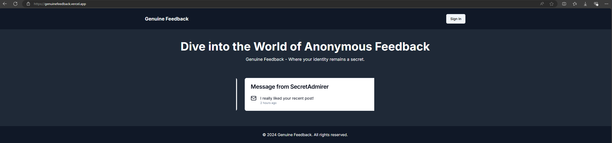
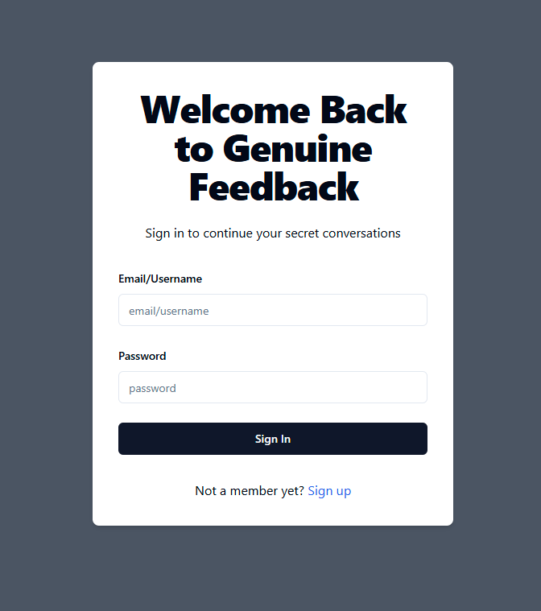
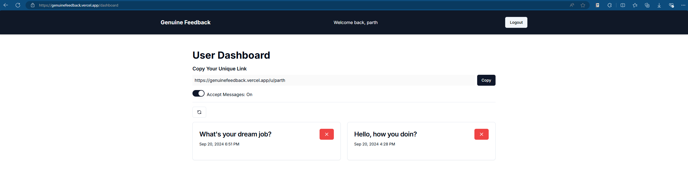
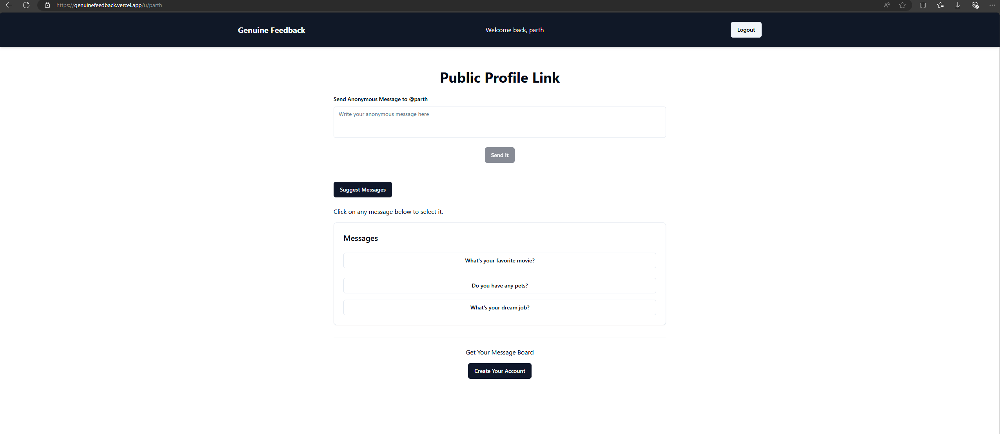

# Genuine Feedback

Genuine Feedback is a platform that allows users to create unique URLs to collect anonymous feedback from others. Users can sign up, share their unique links, and receive valuable insights without revealing their identity.

## Features

- **User Registration:** Sign up to create an account.
- **Unique URLs:** Generate a unique URL for collecting feedback.
- **Anonymous Feedback:** Share your link with others to receive anonymous responses.
- **Feedback Management:** View and manage all received feedback easily.

## Tech Stack

- **Frontend:** Next.js, Tailwind CSS
- **Authentication:** NextAuth
- **Data Validation:** Zod
- **Database:** MongoDB
- **Email Service:** Resend
- **OpenAI Integration:** Suggest feedbacks to user

## Getting Started

### Prerequisites

Make sure you have the following installed:

- Node.js
- MongoDB

### Installation

1. Clone the repository:

   ```bash
   git clone https://github.com/mparth14/genuinefeedback.git
   cd genuine-feedback

2. Install the dependencies:

    ```bash
    npm install

3. Set up your environment variables in a .env file. You can use the .env.example file as a reference.

4. Start the development server:
    
    ```bash
    npm run dev

5. Open your browser and go to http://localhost:3000 to see the application in action.

## Contributing

Contributions are welcome! If you have suggestions for improvements or features, feel free to open an issue or submit a pull request.

## Acknowledgements

This project was inspired by the YouTube tutorial [How to Build a Feedback App with Next.js](https://www.youtube.com/watch?v=zLJoVRleOuc) by Hitesh Choudhary. You can find the original project on GitHub [here](https://github.com/hiteshchoudhary/ama-app).

Contributions are welcome! If you have suggestions for improvements or features, feel free to open an issue or submit a pull request.

## Screenshots

Here are some screenshots of the Genuine Feedback application:

### Home Page


### Sign In Page


### User Dashboard


### User Unique Link

